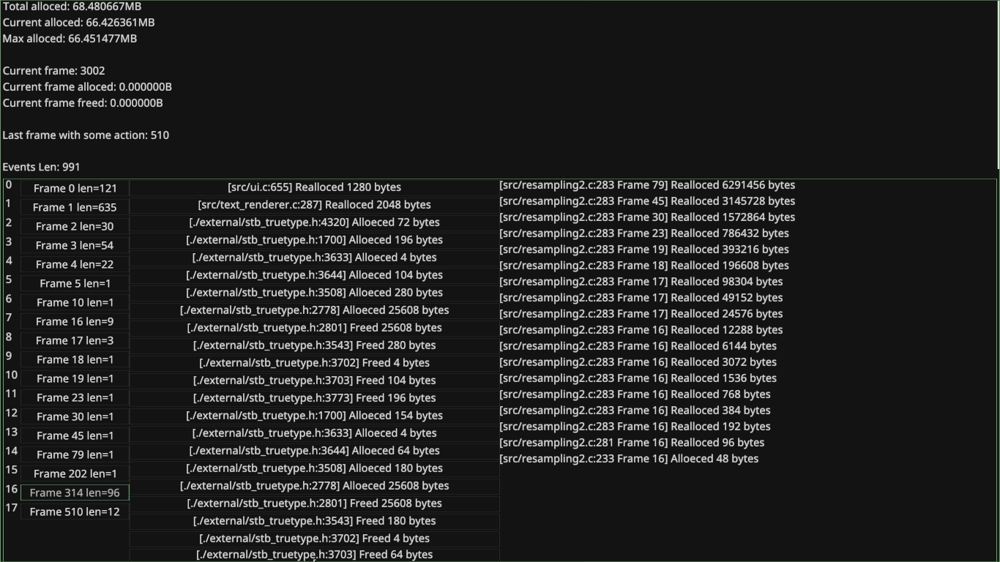

# Memory tracker and debugger

## Why
I wanted to see which parts of my other project [brplot](https://github.com/branc116/brplot) allocate memory.

## Screenshot
I've also created a visializtion of memory in brplot:


## Usecases

### Track allocated memory

Example:
```c
#define BR_MEMORY_TRACER_IMPLEMENTATION
#include "../br_memory.h"

int main(void) {
  void* mem = BR_MALLOC(128);
  mem = BR_REALLOC(mem, 256);
  mem = BR_REALLOC(mem, 512);
  mem = BR_REALLOC(mem, 1024);
  BR_FREE(mem);
  br_malloc_stack_print(0);
  return 1;
}
```

Output:
```output
=================================
Newer nodes:
main.c:9 Free 1024 bytes at Frame 0
main.c:8 Realloc to 1024 bytes at Frame 0
main.c:7 Realloc to 512 bytes at Frame 0
main.c:6 Realloc to 256 bytes at Frame 0
--------------------------------
Current node:
main.c:5 Alloc 128 bytes at Frame 0
=================================
```

### Detect common mistakes

#### Example double free

```c
#define BR_MEMORY_TRACER_IMPLEMENTATION
#include "../br_memory.h"

int main(void) {
  void* mem = BR_MALLOC(128);
  BR_FREE(mem);
  BR_FREE(mem);
}
```

Output:
```
=================================
Current node:
tests/double_free.c:6 Free 128 bytes at Frame 0
--------------------------------
Older node:
tests/double_free.c:5 Alloc 128 bytes at Frame 0
=================================

[FATAL] tests/double_free.c:7 -> Double free!
```

#### Example using realloced memory:

```c
#define BR_MEMORY_TRACER_IMPLEMENTATION
#include "../br_memory.h"

int main(void) {
  void* mem = BR_MALLOC(128);
  BR_REALLOC(mem, 256);
  BR_FREE(mem);
}
```

```output
=================================
Newer nodes:
tests/bad_realloc.c:6 Realloc to 256 bytes at Frame 0
--------------------------------
Current node:
tests/bad_realloc.c:5 Alloc 128 bytes at Frame 0
=================================

[FATAL] tests/bad_realloc.c:7 -> Freeing realloced memory!
```
